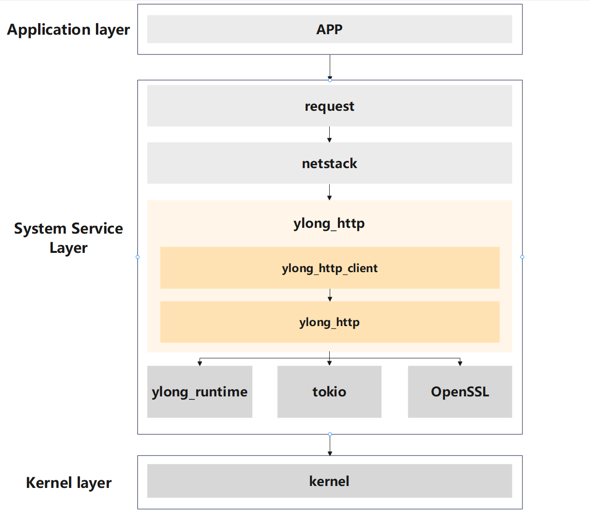
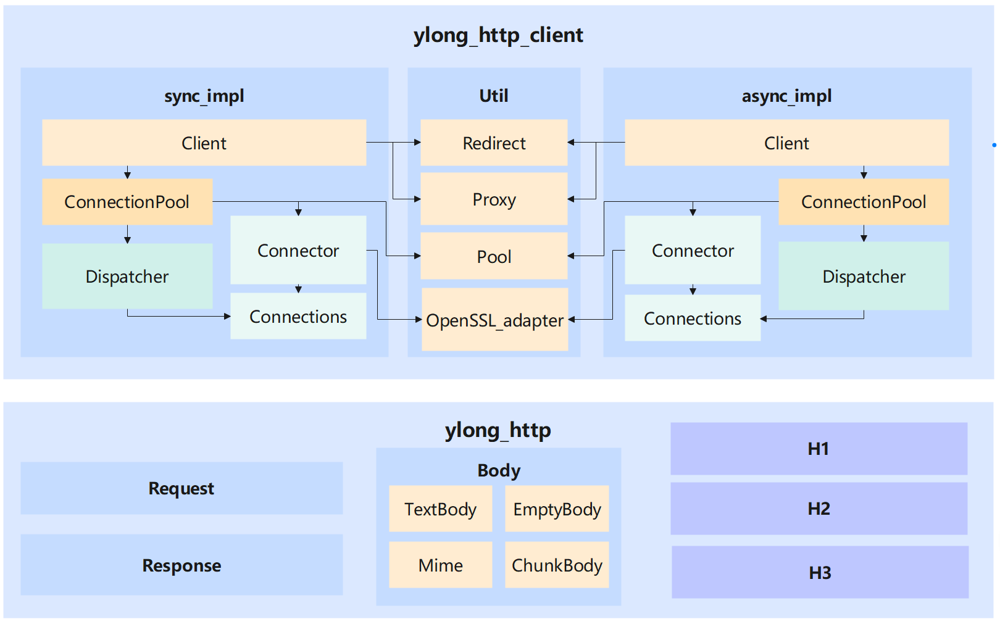

# ylong_http

## Introduction

`ylong_http` has built a complete HTTP capability, supporting users to use HTTP
capability to meet the needs of communication scenarios.

`ylong_http` is written in the Rust language to support OpenHarmony's Rust
capability.

### The position of ylong_http in OpenHarmony

`ylong_http` provides HTTP protocol support to the `netstack` module in the
`OpenHarmony` system service layer, and through the `netstack` module, helps
upper layer applications build HTTP communication capabilities.



The following is the description information for the key fields in the figure above:

- `APP`: A direct user facing upper level application that requires the ability to upload and download.
- `request`: The component in the OpenHarmony system service layer that provides upload and download capabilities.
- `netstack`: The system component in the OpenHarmony system service layer that provides network protocol stack functionality.
- `ylong_http`: The system component in the OpenHarmony system service layer that provides HTTP protocol stack functionality.
    - `ylong_http_client`: One of the modules under `ylong_http` provides HTTP client capabilities.
    - `ylong_http`: One of the modules under `ylong_http` provides the basic components of HTTP.
- `ylong_runtime`: Rust asynchronous runtime library provided by `ylong` in the system service layer.
- `tokio`: The third-party rust asynchronous runtime library commonly used in the industry.
- `OpenSSL`: A commonly used third-party TLS implementation library in the industry.

### The internal structure of ylong_http



`ylong_http` is currently divided into two main modules: `ylong_http_client` client module and `ylong_http` protocol component module.

The `ylong_http_client` module is responsible for providing HTTP client functions, which can support users to send HTTP requests and receive HTTP responses. It is divided into three main parts:
- `sync_impl`: A synchronous HTTP client implementation that does not depend on any runtime and can run directly on the thread model, but uses a synchronous blocking strategy as a whole.
- `async_impl`: an asynchronous HTTP client implementation that requires the use of Rust's asynchronous runtime components. The asynchronous HTTP client takes advantage of Rust's asynchronous capabilities and has excellent performance.
- `Util`: The synchronous and asynchronous HTTP client parts are common, such as automatic redirection, HTTP proxy, etc.

The interface prototypes of `sync_impl` and `async_impl` are basically the same (mainly the difference between Rust asynchronous syntax and synchronous syntax), so users can switch between synchronous and asynchronous logic with a small amount of code changes.

The overall structure of `sync_impl` and `async_impl` is the same, divided into the following modules:
- `Client`: Provide the basic interface of the HTTP client externally, such as configuring related options of the client, sending HTTP requests, etc.
- `ConnectionPool`: Mainly responsible for a large number of connection management, managing the life cycle of all `Dispatcher`, including start, run, stop. The HTTP protocol is a connection-based communication protocol, involving functions such as connection multiplexing and connection management.
- `Dispatcher`: Mainly responsible for single connection management, managing the start, operation, stop, and transmission of a single connection. Each connection is governed by a `Dispatcher`, and it is up to the `Dispatcher` to determine whether the current request to be sent uses the connection it manages.
- `Connections`: connection object, which can be a TCP connection, a TLS connection or a more generalized connection object. Messages are transmitted and received on this connection, and it is the base of `Client` and the HTTP protocol.
- `Connector`: Responsible for creating connection objects. Connector is also a trait that users can use to define the behavior when creating a connection.

`Util` contains the common capabilities of synchronous and asynchronous HTTP clients, such as:
- `Redirect`: HTTP automatic redirection capability. When the HTTP response returns a status code related to redirection, the HTTP client will perform automatic redirection and automatically send a new request to the next hop.
- `Proxy`: HTTP proxy capability. When an HTTP request is sent, it is sent to a proxy instead of directly to the origin server, and the proxy server then returns the origin server's response.
- `Pool`: Universal connection pool implementation, supports the management of multiple synchronous or asynchronous connections, facilitates the reuse of existing connections by upper-layer synchronous or asynchronous clients, reduces the number of repeated connection creations, and improves performance.
- `OpenSSL_adapter`: HTTPS needs to use TLS capability on the basis of HTTP, and OpenSSL is used on OpenHarmony, so the OpenSSL interface needs to be encapsulated in Rust.

The `ylong_http` module is responsible for providing the basic capabilities of HTTP, such as HTTP2's HPACK, HTTP3's QPACK, etc. It mainly includes the following key modules:
- `Request`: The basic capability of HTTP requests, which implements all the content and behaviors of HTTP requests according to `RFC9110`. HTTP requests are mainly used to send requests to specified servers.
- `Response`: The basic capability of HTTP response, which implements all the content and behavior of HTTP response according to `RFC9110`. The HTTP response is basically the server's response to the client's request.
- `Body`:
  HTTP message body capability, according to `RFC9110` regulations to achieve all the content and behavior of the HTTP message body. The HTTP message body holds the main data content for client and server communication.
  The HTTP message body has various forms in the protocol, and there are corresponding implementations in the `ylong_http` library. For example, `EmptyBody` corresponds to an empty message body, `TextBody` corresponds to a plaintext message body, and `ChunkBody` corresponds to a chunked message body. `Mime` corresponds to the Multipart message body.
- `H1`: All basic capabilities of HTTP1, such as encoders and decoders for requests and responses in HTTP1 format.
- `H2`: All basic capabilities of HTTP2, such as encoders and decoders for requests and responses in HTTP2 format, HTTP2 frame encoders and decoders, HPACK, etc.
- `H3`: All basic capabilities of HTTP3, such as encoders and decoders for requests and responses in HTTP3 format, QPACK, etc.

## HTTPS Proxy Support

`ylong_http_client` now supports HTTP and HTTPS proxy endpoints through a common
proxy module shared by the synchronous and asynchronous clients. The HTTPS proxy
path is implemented on top of the OpenSSL adapter and supports both direct HTTP
proxy forwarding and HTTPS-over-proxy tunnels.

Key capabilities:

- Plain HTTP proxy and TLS-protected HTTPS proxy endpoints.
- HTTPS target requests through `CONNECT` tunnels.
- Proxy TLS verification with a custom CA file.
- Proxy mutual TLS with a client certificate and private key.
- Proxy TLS tuning such as OpenSSL cipher-list configuration.
- A reusable tunnel parser and request builder for future proxy protocol
  extensions.

Example:

```rust
use ylong_http_client::async_impl::{Body, ClientBuilder, Request};
use ylong_http_client::{Proxy, TlsConfig, TlsFileType};

async fn request_via_https_proxy() -> Result<(), Box<dyn std::error::Error + Send + Sync>> {
    let proxy_tls = TlsConfig::builder()
        .ca_file("certs/proxy-ca.pem")
        .certificate_file("certs/client.pem", TlsFileType::PEM)
        .private_key_file("certs/client.key", TlsFileType::PEM)
        .cipher_list("TLS_AES_256_GCM_SHA384:TLS_CHACHA20_POLY1305_SHA256")
        .build()?;

    let proxy = Proxy::all("https://proxy.example.com:8443")
        .tls_config(proxy_tls)
        .build()?;

    let client = ClientBuilder::new().proxy(proxy).build()?;
    let request = Request::builder()
        .url("https://target.example.com/data")
        .body(Body::empty())?;

    let _response = client.request(request).await?;
    Ok(())
}
```

When the TLS feature is disabled, configuring an HTTPS proxy returns a connect
error instead of silently downgrading the proxy transport. HTTP/3 over proxy is
currently rejected explicitly.

### Benchmark

The `https_proxy_bench` binary compares `ylong_http_client` with curl/libcurl in
an HTTPS proxy topology. The checked-in benchmark driver starts a local TLS proxy,
runs paired ylong/curl batches from a Conda Python environment, and emits both
CSV results and publication-style PDF/PNG figures.

```powershell
cargo build -p ylong_http_client --no-default-features `
  --features "async,http1_1,ylong_base,c_openssl_3_0" `
  --release --bin https_proxy_bench

conda run -n base python docs\benchmarks\run_https_proxy_bench.py `
  --requests "200,1000,3000" --repeats 5 --warmup 50
```


The local reproducible benchmark uses a 4096-byte response body and five paired
runs per request count.

| Requests | ylong latency/request | curl latency/request | Improvement vs curl |
| ---: | ---: | ---: | ---: |
| 200 | 0.0770 ms | 2.0953 ms | 96.24% |
| 1000 | 0.1224 ms | 2.3173 ms | 94.72% |
| 3000 | 0.1076 ms | 3.0103 ms | 96.42% |

For a contest or production proxy environment, reuse the same binary and replace
the target variables:

```powershell
$env:NO_PROXY = ""
$env:no_proxy = ""
$env:YLONG_BENCH_URL = "https://target.example.com/path"
$env:YLONG_HTTPS_PROXY = "https://proxy.example.com:8443"
$env:YLONG_BENCH_REQUESTS = "1000"
$env:YLONG_BENCH_WARMUP = "50"
$env:YLONG_CURL = "D:\msys64\mingw64\bin\curl.exe"

# Optional proxy TLS verification and mutual TLS:
$env:YLONG_PROXY_CA_FILE = "D:\certs\proxy-ca.pem"
$env:YLONG_PROXY_CERT_FILE = "D:\certs\client.pem"
$env:YLONG_PROXY_KEY_FILE = "D:\certs\client.key"
$env:YLONG_PROXY_CIPHER_LIST = "TLS_AES_256_GCM_SHA384:TLS_CHACHA20_POLY1305_SHA256"

.\target\release\https_proxy_bench.exe
```

Use `YLONG_PROXY_CA_FILE` for private proxy CAs. Reserve
`YLONG_PROXY_INSECURE=1` for local testing.

## Build

`GN` is supported. User should add dependencies in `deps` of `BUILD.gn` to build this crate.

```gn
deps += ["//example_path/ylong_http_client:ylong_http_client"]
```

`Cargo` is supported. User should add dependencies in ```Cargo.toml``` to build this crate.

```toml
[dependencies]
ylong_http_client = { path = "/example_path/ylong_http_client" }
```

## Directory

```text
ylong_http
├── docs                        # User's guide
├── figures                     # Resources
├── patches                     # Patches for ci
├── ylong_http
│   ├── examples                # Examples of ylong_http
│   ├── src                     # Source code ylong_http
│   │   ├── body                # Body trait and body types
│   │   ├── h1                  # HTTP/1.1 components
│   │   ├── h2                  # HTTP/2 components
│   │   ├── h3                  # HTTP/3 components
│   │   ├── huffman             # Huffman
│   │   ├── request             # Request type
│   │   └── response            # Response type
│   └── tests                   # Tests of ylong_http
│
└── ylong_http_client
    ├── examples                # Examples of ylong_http_client
    ├── src                     # Source code of ylong_http_client
    │   ├── async_impl          # Asynchronous client implementation
    │   │   ├── conn            # Asynchronous connection layer
    │   │   ├── downloader      # Asynchronous downloader layer
    │   │   ├── ssl_stream      # Asynchronous TLS layer
    │   │   └── uploader        # Asynchronous uploader layer
    │   ├── sync_impl           # Synchronous client implementation
    │   │   └── conn            # Synchronous connection layer
    │   └── util                # Components of ylong_http_client
    │       ├── c_openssl       # OpenSSL adapter
    │       │   ├── ffi         # OpenSSL ffi adapter
    │       │   └── ssl         # OpenSSL ssl adapter
    │       └── config          # Configures
    │           └── tls         # TLS Configures
    │               └── alpn    # ALPN Configures
    └── tests                   # Tests of ylong_http_client
```
