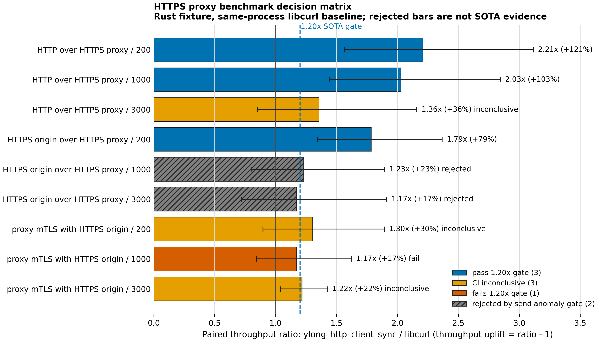
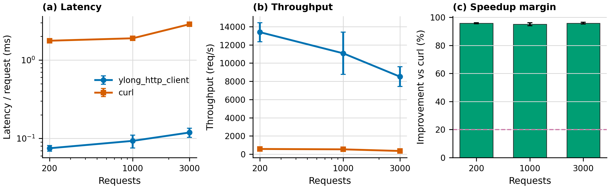

# ylong_http

`ylong_http` provides HTTP protocol and client capabilities for OpenHarmony's
Rust networking stack. The workspace contains:

- `ylong_http`: protocol primitives for HTTP/1.1, HTTP/2, HTTP/3, request and
  response parsing, body types, HPACK/QPACK related components, and codecs.
- `ylong_http_client`: synchronous and asynchronous HTTP clients with
  connection management, TLS integration, redirect handling, proxy support, and
  shared utility modules.

The client is designed to work with both the `ylong_runtime` ecosystem and the
Rust async model while keeping synchronous and asynchronous public interfaces
close enough for users to switch between them with limited code changes.

## Architecture

The `ylong_http_client` module is split into three major layers:

- `async_impl`: asynchronous client, connector, connection, upload, and download
  implementations.
- `sync_impl`: blocking client and connection implementations for thread-based
  users.
- `util`: shared configuration, proxy, redirect, TLS, information, and
  connection-pool utilities.

Connection establishment is isolated in connector modules. Proxy selection and
proxy endpoint metadata are centralized in `util::proxy`, so synchronous and
asynchronous connectors use the same matching, authentication, `no_proxy`, and
tunnel parsing behavior.

## HTTPS Proxy Support

`ylong_http_client` supports both plaintext HTTP proxies and TLS-protected HTTPS
proxy endpoints. HTTPS proxy transport is implemented on top of the OpenSSL
adapter. HTTPS origin requests through a proxy use this sequence:

1. Connect to the proxy endpoint.
2. If the proxy URL uses `https://`, complete TLS with the proxy.
3. Send an HTTP/1.1 `CONNECT host:port` tunnel request.
4. Validate the proxy response.
5. Complete the origin TLS handshake over the established tunnel.

Key capabilities:

- HTTP proxy forwarding for HTTP origin requests.
- HTTPS-over-proxy tunnels via `CONNECT`.
- HTTPS proxy endpoint TLS verification with custom CA files.
- HTTPS proxy mutual TLS through client certificate and private key files.
- OpenSSL cipher-list configuration for the proxy TLS hop.
- Shared proxy module for sync and async clients.
- Explicit failure when HTTPS proxy is configured without TLS support.
- Explicit rejection for HTTP/3 over proxy.
- Strict tunnel response parsing with capped proxy header size.
- Hot-path proxy authentication reuse without allocating a fresh `String` per
  tunnel request.
- Single-pass `CONNECT` response boundary scanning with numeric status-code
  validation.

Example:

```rust
use ylong_http_client::async_impl::{Body, ClientBuilder, Request};
use ylong_http_client::{Proxy, TlsConfig, TlsFileType};

async fn request_via_https_proxy() -> Result<(), Box<dyn std::error::Error + Send + Sync>> {
    let proxy_tls = TlsConfig::builder()
        .ca_file("certs/proxy-ca.pem")
        .certificate_file("certs/client.pem", TlsFileType::PEM)
        .private_key_file("certs/client.key", TlsFileType::PEM)
        .cipher_list("TLS_AES_256_GCM_SHA384:TLS_CHACHA20_POLY1305_SHA256")
        .build()?;

    let proxy = Proxy::all("https://proxy.example.com:8443")
        .tls_config(proxy_tls)
        .build()?;

    let client = ClientBuilder::new().proxy(proxy).build()?;
    let request = Request::builder()
        .url("https://target.example.com/data")
        .body(Body::empty())?;

    let _response = client.request(request).await?;
    Ok(())
}
```

## Benchmark

The `https_proxy_bench` binary measures `ylong_http_client` in a local HTTPS
proxy topology. The benchmark harness uses a native Rust `https_proxy_fixture`
by default so local proxy/origin timing is not dominated by Python TLS
`sendall` scheduling. The previous Python fixture is still available as
`--fixture python-smoke` for diagnostics only; it is not accepted by the SOTA
gate.

The harness supports two separately named baselines:

- `curl_cli`: a curl executable process baseline, enabled with `YLONG_CURL`.
- `libcurl`: a same-process libcurl library baseline, enabled with
  `YLONG_LIBCURL=1` and the Cargo feature `libcurl_bench`.

Do not combine these labels in reports. A curl CLI batch includes process and
command-line mechanics; a libcurl batch is the required baseline for SOTA
performance claims.

```powershell
cargo build -p ylong_http_client --no-default-features `
  --features "async,http1_1,ylong_base,c_openssl_3_0,libcurl_bench" `
  --release --bin https_proxy_bench

cargo build -p ylong_http_client --no-default-features `
  --features "bench_fixture" `
  --release --bin https_proxy_fixture

conda run -n base python docs\benchmarks\run_https_proxy_bench.py `
  --baseline libcurl --ylong-client sync --scenario all `
  --requests "200,1000,3000" --repeats 5 --warmup 50 `
  --client-order interleaved --client-order-seed 20260707 `
  --fixture rust --fixture-bin target\release\https_proxy_fixture.exe
```





The gate summary is the decision figure. The raw ratio matrix is a supporting
metric view for throughput, p95 latency, CPU/request, and RSS peak. A throughput
ratio of `2.208x` means `+120.8%` throughput and about `-54.7%` elapsed time;
it should not be described as only "20% faster".

Current canonical local benchmark requirements:

- fixture: native Rust `https_proxy_fixture`
- response body: 4096 bytes
- request body: 0 bytes
- warmup: 50 requests
- repeats: 5 paired runs
- request counts: 200, 1000, 3000
- baseline: same-process libcurl
- candidate: `ylong_http_client_sync`
- client order: deterministic interleaving by repeat, seed `20260707`
- scenarios: HTTP over HTTPS proxy, HTTPS origin over HTTPS proxy, proxy mTLS
  with HTTPS origin
- proxy TLS: local CA verified
- origin TLS: local CA verified for HTTPS-origin scenarios
- connection reuse trace: ylong and libcurl both reuse one proxy connection per
  repeat; HTTPS-origin scenarios also use one CONNECT tunnel and one origin TLS
  connection per repeat

Latest checked-in Rust fixture full-matrix evidence:

- raw output:
  `docs/benchmarks/results/tunnel-gate-libcurl-sync-full/https_proxy_bench_results.csv`
- summary output:
  `docs/benchmarks/results/tunnel-gate-libcurl-sync-full/https_proxy_bench_summary.csv`
- ratio output:
  `docs/benchmarks/results/tunnel-gate-libcurl-sync-full/https_proxy_bench_comparison.csv`
- environment:
  `docs/benchmarks/results/tunnel-gate-libcurl-sync-full/https_proxy_bench_env.json`

Latest Rust fixture matrix results:

| Scenario | Requests | Throughput ratio | Throughput uplift | Elapsed reduction | 95% CI | p95 latency | CPU/request | RSS peak | Gate |
| --- | ---: | ---: | ---: | ---: | ---: | ---: | ---: | ---: | --- |
| HTTP over HTTPS proxy | 200 | 2.208x | +120.8% | -54.7% | [1.565x, 3.114x] | 0.435x | 0.381x | 1.058x | `pass_sota20` |
| HTTP over HTTPS proxy | 1000 | 2.027x | +102.7% | -50.7% | [1.444x, 2.845x] | 0.541x | 0.409x | 1.062x | `pass_sota20` |
| HTTP over HTTPS proxy | 3000 | 1.355x | +35.5% | -26.2% | [0.852x, 2.157x] | 0.652x | 0.622x | 1.063x | `inconclusive_ci` |
| HTTPS origin over HTTPS proxy | 200 | 1.785x | +78.5% | -44.0% | [1.346x, 2.367x] | 0.529x | 0.457x | 1.066x | `pass_sota20` |
| HTTPS origin over HTTPS proxy | 1000 | 1.231x | +23.1% | -18.8% | [0.800x, 1.895x] | 0.640x | 0.705x | 1.053x | `reject_proxy_send_anomaly` |
| HTTPS origin over HTTPS proxy | 3000 | 1.172x | +17.2% | -14.7% | [0.719x, 1.911x] | 0.902x | 0.663x | 1.059x | `reject_proxy_send_anomaly` |
| proxy mTLS with HTTPS origin | 200 | 1.302x | +30.2% | -23.2% | [0.896x, 1.891x] | 0.753x | 0.633x | 1.061x | `inconclusive_ci` |
| proxy mTLS with HTTPS origin | 1000 | 1.171x | +17.1% | -14.6% | [0.846x, 1.621x] | 0.610x | 0.690x | 1.055x | `fail_sota20` |
| proxy mTLS with HTTPS origin | 3000 | 1.219x | +21.9% | -17.9% | [1.042x, 1.426x] | 0.657x | 0.702x | 1.062x | `inconclusive_ci` |

This Rust fixture run verifies the same-process libcurl baseline path, verified
proxy TLS, HTTPS-origin tunneling, proxy mTLS, metric columns, scenario-ratio
output, connection-reuse trace, client order metadata, paired aggregation, and
response-path send anomaly gates. The gate result is mixed: 3 cells pass the
`1.20x` throughput gate, 3 cells are CI-inconclusive, 2 cells are rejected by
the response-path send anomaly gate, and 1 cell fails the `1.20x` gate. Because
the matrix still has rejected and failing cells, it does not support a full
matrix SOTA claim; it supports the narrower claim shown by the three
`pass_sota20` cells.

Checked-in `gen006-benchmark-trust-repaired` results are historical
counterexample evidence from the Python fixture era. They explain why the old
figure could not support a SOTA claim, but they are not the canonical Rust
fixture matrix:

- raw output:
  `docs/benchmarks/results/gen006-benchmark-trust-repaired/https_proxy_bench_results.csv`
- summary output:
  `docs/benchmarks/results/gen006-benchmark-trust-repaired/https_proxy_bench_summary.csv`
- ratio output:
  `docs/benchmarks/results/gen006-benchmark-trust-repaired/https_proxy_bench_comparison.csv`
- old gen005 data recomputed with repaired gates:
  `docs/benchmarks/results/gen006-benchmark-trust-repaired/gen005_recomputed_with_repaired_gates.csv`

Historical fair-matrix and counterexample runs remain under
`docs/benchmarks/results/`, including `tokio-full/`, but they are not the
canonical README figure source.

For a contest or production proxy environment, reuse the same release binary and
replace only the target/proxy variables.

```powershell
$env:NO_PROXY = ""
$env:no_proxy = ""
$env:YLONG_BENCH_URL = "https://target.example.com/path"
$env:YLONG_HTTPS_PROXY = "https://proxy.example.com:8443"
$env:YLONG_BENCH_REQUESTS = "1000"
$env:YLONG_BENCH_WARMUP = "50"
$env:YLONG_LIBCURL = "1"

# Optional proxy TLS verification and mutual TLS:
$env:YLONG_PROXY_CA_FILE = "D:\certs\proxy-ca.pem"
$env:YLONG_PROXY_CERT_FILE = "D:\certs\client.pem"
$env:YLONG_PROXY_KEY_FILE = "D:\certs\client.key"
$env:YLONG_PROXY_CIPHER_LIST = "TLS_AES_256_GCM_SHA384:TLS_CHACHA20_POLY1305_SHA256"

.\target\release\https_proxy_bench.exe
```

Use `YLONG_PROXY_CA_FILE` for private proxy CAs. Reserve
`YLONG_PROXY_INSECURE=1` for local testing only.

## Validation

The HTTPS proxy path is covered by targeted unit and integration-style tests
across the OpenSSL, non-TLS, sync, and async code paths.

```powershell
cargo test -p ylong_http_client --no-default-features `
  --features "async,http1_1,tokio_base,c_openssl_3_0" `
  --test sdv_async_https_proxy_tls -- --test-threads=1

cargo test -p ylong_http_client --no-default-features `
  --features "sync,async,http1_1,tokio_base,c_openssl_3_0" `
  --test sdv_sync_https_proxy_tls -- --test-threads=1

cargo test -p ylong_http_client --no-default-features `
  --features "sync,async,http1_1,tokio_base" `
  --test sdv_https_proxy_no_tls -- --test-threads=1

cargo test -p ylong_http_client --no-default-features `
  --features "async,http1_1,tokio_base" `
  ut_tunnel_request_and_response
```

## Build

Cargo is supported:

```toml
[dependencies]
ylong_http_client = { path = "/example_path/ylong_http_client" }
```

GN is supported. Add the crate to the target `deps`:

```gn
deps += ["//example_path/ylong_http_client:ylong_http_client"]
```

## Directory

```text
ylong_http
|-- docs                         # User guide and benchmark assets
|-- docs/benchmarks              # HTTPS proxy benchmark driver and CSV results
|-- docs/figures                 # Generated benchmark figures
|-- figures                      # Architecture resources
|-- patches                      # CI patches
|-- ylong_http                   # HTTP protocol components
|   |-- examples                 # Examples of ylong_http
|   |-- src
|   |   |-- body                 # Body trait and body types
|   |   |-- h1                   # HTTP/1.1 components
|   |   |-- h2                   # HTTP/2 components
|   |   |-- h3                   # HTTP/3 components
|   |   |-- huffman              # Huffman codec
|   |   |-- request              # Request type
|   |   `-- response             # Response type
|   `-- tests                    # Tests of ylong_http
`-- ylong_http_client
    |-- examples                 # Examples of ylong_http_client
    |-- src
    |   |-- async_impl           # Asynchronous client implementation
    |   |-- bin                  # Utility binaries, including https_proxy_bench
    |   |-- sync_impl            # Synchronous client implementation
    |   `-- util                 # Shared client utilities
    |       |-- c_openssl        # OpenSSL adapter
    |       |-- config           # Client, proxy, and TLS configuration
    |       `-- proxy.rs         # Shared proxy selection and tunnel utilities
    `-- tests                    # Tests of ylong_http_client
```
